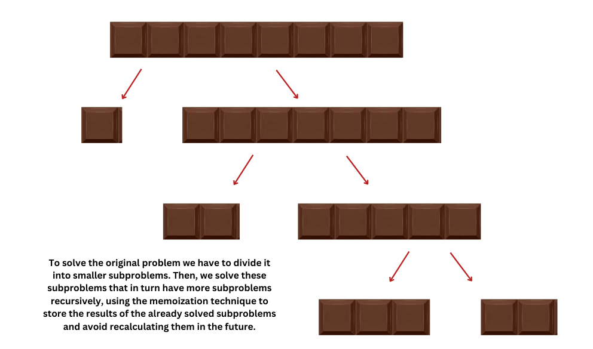
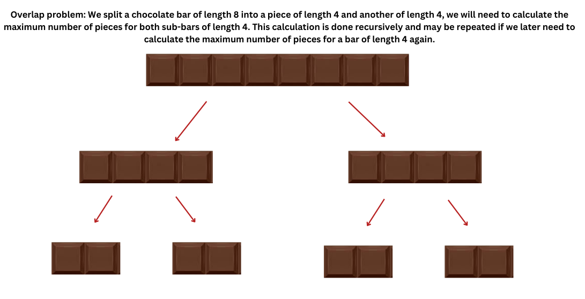
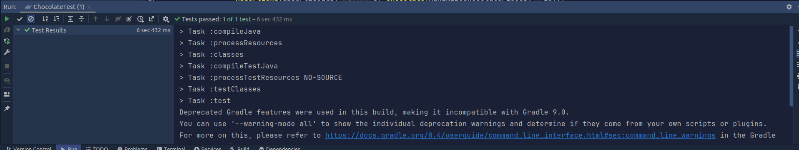
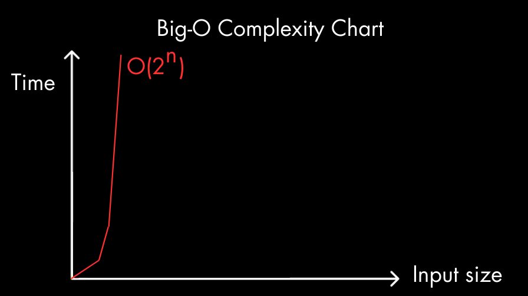
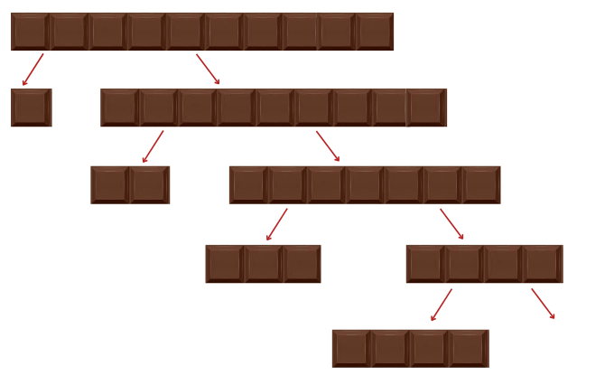
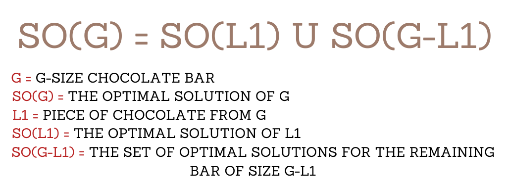
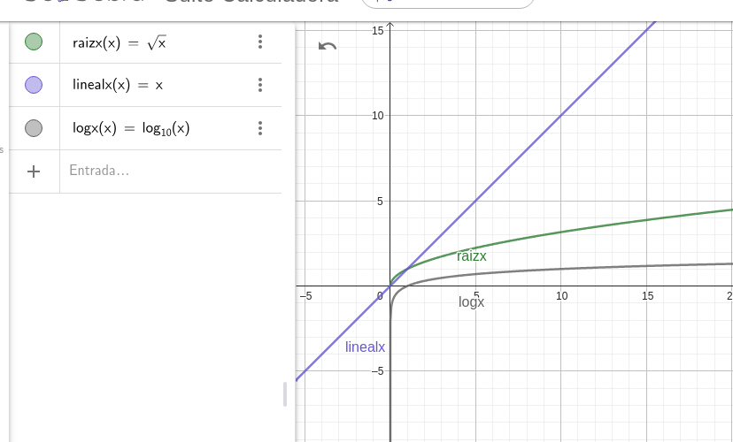

# 
Chocolate Bar Project Analysis

### 1. Identify if this problem can be solved with dynamic programming and/or a greedy algorithm

    GREEDY ALGORITHM
    Yes, this problem can be solved with a greedy algorithm, which would try to maximize the number of chocolate pieces at each step, and in fact, this approach can guarantee the maximum total number of pieces. By dividing the chocolate bar into the largest possible piece at each step or always choosing the smallest piece at each step, it can lead to the maximum total number of pieces due to the nature of the problem and the different combinations that could be most beneficial to maximize the number of pieces.
    For example: My greedy choice is to divide the chocolate bar into the largest possible pieces at each step, which allows us to obtain the maximum number of chocolate pieces possible, verifying that the divided pieces are different and that the divided piece is not greater than or equal to the leftover piece, if so returning the number of pieces formed up to the previous step.
    In the first step we divide the bar 1x5 into 1x4 and 1x1, which would result in only two pieces, In the second step we divide the bar 1x4 into 1x2 and 1x2, which would result in only two pieces (Returns 1x4 - 1x1).

    DYNAMIC PROGRAMMING ALGORITHM
    Yes, this problem can be solved with dynamic programming. I solved the exercise with a dynamic programming (DP) approach known as "top-down".
    In this approach, we start with the original problem and divide it into smaller subproblems. Then, we solve these subproblems recursively, usually using the memoization technique to store the results of the already solved subproblems and avoid recalculating them in the future.
    Backtracking is used to ensure that all possible combinations of chocolate bar divisions are explored. It aids problem solving by allowing us to explore all possible options and find the optimal combination that maximizes the number of chocolate pieces.

   ##### (a) If you say that can be solved with dynamic programming
   i. Analyze the problem based on sub-problems. 
   
    Maximizing the number of pieces when dividing a chocolate bar into different sizes can be analyzed based on these subproblems:

    - [ ] Division into smaller sub-bars:
        In this subproblem we consider all possible ways of dividing a chocolate bar of length n into smaller sub-bars. Each division into a smaller sub-bar creates a new subproblem that must be solved to maximize the total number of pieces.

    - [ ] Optimization at each division:
        Each time we divide the chocolate bar into a smaller sub-bar, we must determine the best way to do so to maximize the total number of pieces. This involves choosing the length of the division optimally to obtain the maximum number of pieces possible.

    - [ ] Recursion and memorization:
        To solve each subproblem, we can use a combination of recursion and memoization.
            - Using recursion, we can explore all possible ways to divide the chocolate bar into smaller sub-bars.
            - Memorization allows us to store the results of already solved subproblems to avoid recalculating them in the future, thus improving the efficiency of the algorithm.

  

   ii. Identify where the overlap occurs.

    Overlap occurs in this problem when we repeatedly compute the same smaller subproblems during recursion. Specifically, when we divide a chocolate bar of length n into smaller subbars, we may encounter identical subproblems where we must compute the maximum number of chocolate pieces for a given length.
    For example, if we divide a chocolate bar of length 6 into a piece of length 3 and another of length 3, we will need to calculate the maximum number of pieces for both sub-bars of length 3. This calculation is done recursively and is likely to be repeated if we later need to calculate the maximum number of pieces for a bar of length 3 again.
    We solve that by using memoization to avoid recalculating the data in the future.

  

 iii. Implement the code

    import java.util.HashSet;
    import java.util.Scanner;
    import java.util.Set;

    public class Chocolate {

        public static void main(String[] args) {
        Scanner scanner = new Scanner(System.in);
        int n = scanner.nextInt();
        System.out.println(maximizeChocolatePieces(n));
        }

        public static int maximizeChocolatePieces(int n) {
        Set<Integer> coordinates = new HashSet<>();
        return breakChocolate(n, coordinates);
        }

        private static int breakChocolate(int n, Set<Integer> coordinates) {
        int maxPieces = 0;
        for (int size = 1; size <= n; size++) {
            if (!coordinates.contains(size)) {
                coordinates.add(size);
                maxPieces = Math.max(maxPieces, 1 + breakChocolate(n - size, coordinates));
                coordinates.remove(size); // backtrack
            }
        }
        return n == 0 ? 0 : maxPieces;
        }
    }

   iv. What is the time complexity of your solution? 
    
    The time complexity of the presented solution is exponential, specifically O(2^n), where n is the length of the chocolate bar.
    This is because the algorithm uses the technique of top-down dynamic programming with recursion and memoization. 
    Although memoization helps to avoid recalculating the same subproblems, we are still exploring all possible combinations of divisions of the chocolate bar, which involves an exponential number of recursive calls.

  

   ##### (b) If you say that can be solved with a greedy algorithm

   i. Identify the greedy choice. 
   
    My greedy choice is to divide the chocolate bar into the largest possible pieces at each step, which allows us to obtain the maximum number of chocolate pieces possible, verifying that the divided pieces are different and that the divided piece is not greater than or equal to the leftover piece, if so returning the number of pieces formed up to the previous step.

    Examples:

    In the first step we divide the bar 1x4 into 1x3 and 1x1, which would result in only two pieces,
    In the second step we divide the bar 1x3 into 1x1 and 1x2, which would result in only two pieces, (Returns 1x3 - 1x1) 
    
    In the first step we divide the bar 1x3 into 1x2 and 1x1, which would result in only two pieces,
    In the second step we divide the bar 1x3 into 1x0 and 1x2, which would result in only two pieces, (Returns 1x2 - 1x1)
    
    In the first step we divide the bar 1x10 into 1x9 and 1x1, which would result in only two pieces,
    In the second step we divide the bar 1x9 into 1x7 and 1x2, which would result in only two pieces,
    In the second step we divide the bar 1x7 into 1x4 and 1x3, which would result in only two pieces,
    In the second step we divide the bar 1x4 into 1x0 and 1x4, which would result in only two pieces (Returns 1x1 - 1x2 - 1x3 - 1x4).

  

   ii. Explain the optimal substructure. 
   
    The optimal substructure:
    Suppose SO(G) represents the optimal solution for a chocolate bar of size G. If we split this bar into a piece of size L1 in the first step, then the global optimal solution would be the union of two sets:
    The set of optimal solutions for the remaining bar of size (G - L1), represented as SO(G - L1).
    The single solution of splitting the bar into the piece of size L1.
    Therefore, the formula for the optimal substructure can be expressed as:

    SO(G) = SO(L1) U SO(G - L1).
    This formula shows how the optimal solution for a member of size G can be constructed by combining the optimal solution for a first step of size L1 and the optimal solution for the rest of the member of size (G - L1).

  

   iii. Implement the code

    import java.util.Scanner;

    public class Chocolate {

        public static void main(String[] args) {
            Scanner scanner = new Scanner(System.in);
            int n = scanner.nextInt();
            System.out.println(maximizeChocolatePieces(n));
        }

        public static int maximizeChocolatePieces(int n) {
            int pieces = 1, i = n-1;
            while (i > pieces) {
                i -= ++pieces;
            }
            return pieces;
        }
    }

   iv. What is the time complexity of your solution?
    
    The time complexity of the implemented solution is O(√n), where 'n' is the initial number of squares in the chocolate bar. This means that the execution time of the algorithm is proportional to the square root of the size of the chocolate bar.
    The execution time of the algorithm grows similarly to the size of the input raised to the power of 1/2. This is understood as a sublinear complexity, which is between linear (O(n)) and logarithmic (O(log n)).

  

### 2. If you say the problem can not be solved with a greedy algorithm or dynamic program,
   explain the reason using an example. 

    The problem can be solved with both logarithms, each one has its own documentation, code and testing.
